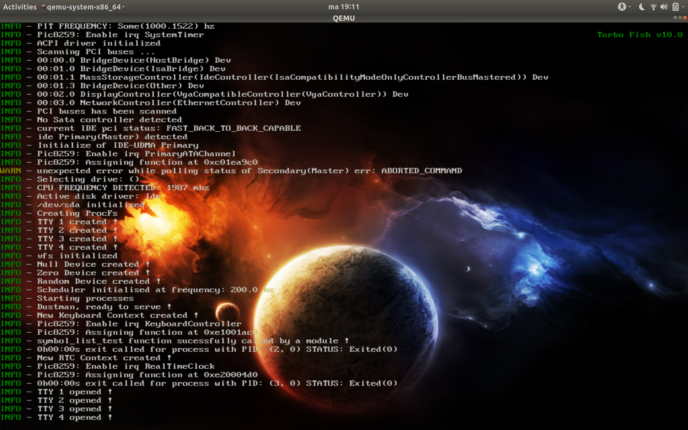
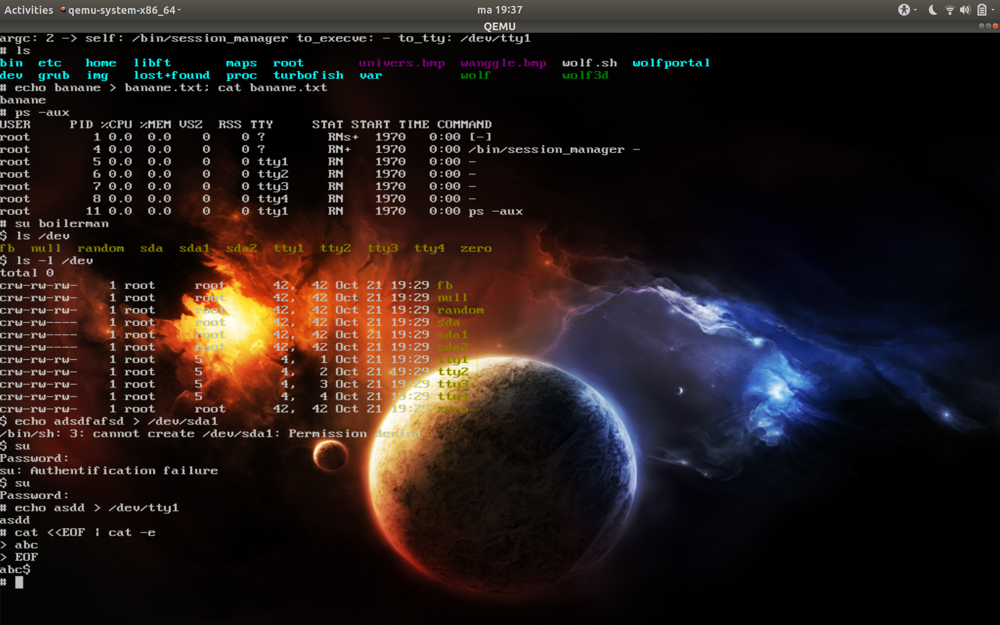

# Turbo fish - Kernel From Scratch

## Screenshot
### log system

### Shell

### A game ;)

## You can test that kernel only on a linux machine

## cloning this repository
You need to clone with submodules  
-> git clone --recurse-submodules GIT_URL  
If you forget to add recurse submodule when you clone, you can add then later like that  
-> git submodule init
-> git submodule update

## For assembly parts, you need a 'nasm' installation (for asm parts)
debian: sudo apt-get install nasm  
archLinux: sudo pacman -S nasm

## For linking, the 'ld' program must be installed on your computer

## the 'grub' programm should be installed in order to create a disk image with kernel

## You need also 'losetup' to create a disk image  
debian: sudo apt-get install mount

## To compile C code, you need to install gcc
debian: sudo apt-get install gcc  
archLinux: sudo pacman -S gcc

## And to execute the kernel, you need 'qemu' (virtual machine system) with kvm

# CAUTION: NEVER BE A SUDOER NOR A ROOT FOR THE RUST INSTALLATION !

The main code of the kernel is in RUST langage, so you have to follow this procedure to install it  
curl and a internet connexion are required to launch the installation  
The total installation of rust takes approximately 1 GB of disc space  

# If you dont have rust on your computer
First, launch the main install procedure: https://www.rust-lang.org/tools/install  
-> curl https://sh.rustup.rs -sSf | sh  
Choose a custom installation, tape 2  
Set default host triple as 'i686-unknown-linux-gnu' then tape enter  
Set default toolchain as 'nightly' then tape enter  
Just tape enter for the path  
Make a coffee and wait a long time... (you have to download near 160mo of data)  

To configure your shell for launching rust binary, you can tape  
-> source $HOME/.cargo/env  
Put this line in your ~.bashrc (or .zshrc etc...) if you want to have definitively this power  

The installation lead to the creation of two hiddens subfolder in your HOME/~, .cargo and .rustup  
when you want to remove completely rust, you have just to remove it !

# If you already have it  
Switch the default toolchain to 'nightly'  
-> rustup toolchain add nightly (install the toolchain)  
-> rustup default nightly (set this toolchain as default)  
Install the default host target to 'i686-unknown-linux-gnu'  
-> rustup target add i686-unknown-linux-gnu (install the target)  

# Now, you need xbuild to cross-compile the rust libcore  
-> cargo install cargo-xbuild  
Then, to recompile libcore, you need rust sources  
-> rustup component add rust-src  

Now, you can 'make' the kernel  
and 'make exec' will launch it with qemu
