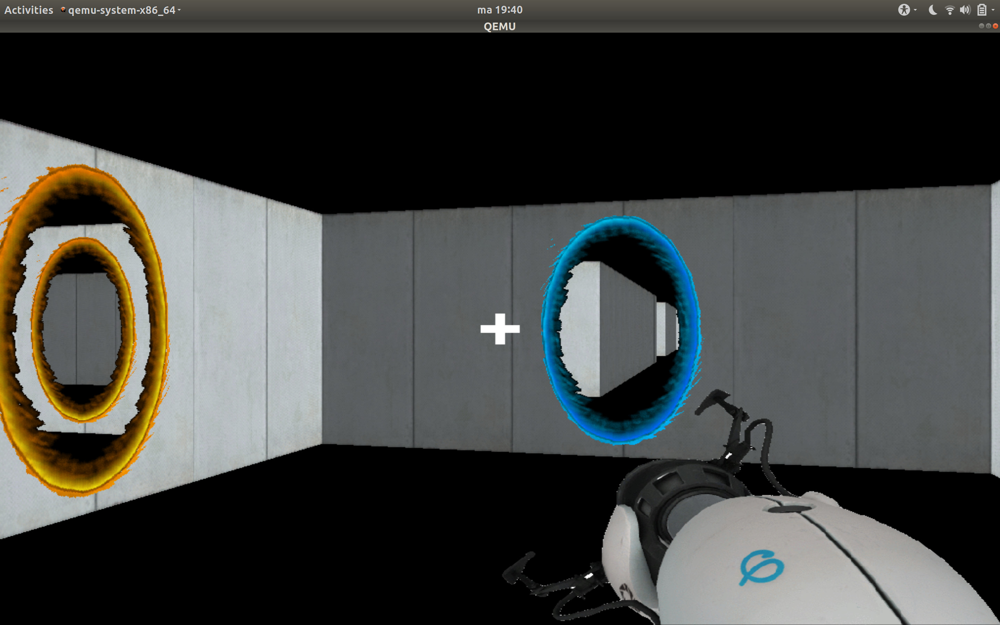
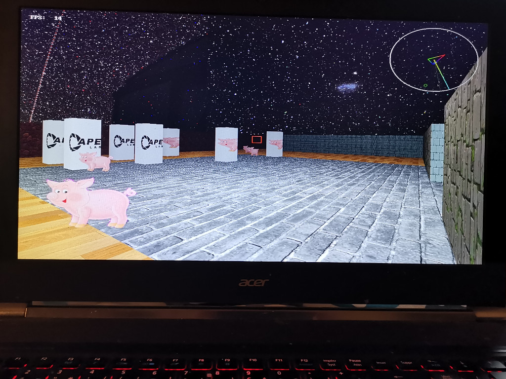

# Turbo fish - 32bits Operating System From Scratch in Rust, C and intel assembly

### log system

### Shell

### The same shell on another TTY

### A game ;) (Running in turbofish OS)

### Another game ! (Taken on real hardware in turbofish OS)

## You can test that kernel only on a linux machine

### cloning this repository
You need to clone with submodules  
`git clone --recurse-submodules GIT_URL`

If you forget to add recurse submodule when you clone, you can add then later like that  
`git submodule init`   
`git submodule update`

### For assembly parts, you need a *nasm* installation (for asm parts)
If you are on a debian system   
`sudo apt-get install nasm`  

Or an archlinux system   
`sudo pacman -S nasm`

### For linking, the *ld* program must be installed on your computer, you need also *make* to build project   
`sudo apt-get install binutils make`

### the *grub* program should be installed in order to create a disk image with kernel
`sudo apt-get install grub`

### install rsync for os disk creation
`sudo apt-get install rsync`

### You need also *losetup* to create a disk image  
`sudo apt-get install mount`

### To compile C code, you need to install *gcc*
If you are on a debian system   
`sudo apt-get install gcc`

Or an archlinux system   
`sudo pacman -S gcc`

# CAUTION: NEVER BE A SUDOER NOR A ROOT FOR THE RUST INSTALLATION !

Now, it's the time to install Rust, The main code of the kernel is in this langage, so you have to follow this procedure to install it. The curl program and a internet connexion are required to launch the installation. The total installation of rust takes approximately 1 GB of disk space so maybe you have to delete some porn videos to free disk space.

## If you dont have rust on your computer
First, launch the main install procedure: https://www.rust-lang.org/tools/install  
`curl https://sh.rustup.rs -sSf | sh`

* Choose a custom installation, tape 2  
* Set default host triple as *i686-unknown-linux-gnu* then tape enter  
* Set default toolchain as *nightly* then tape enter  
* Just tape enter for the path  
* Make a coffee and wait a long time... (you have to download near 160mo of data)  

To configure your shell for launching rust binary, you have to write   
`source $HOME/.cargo/env`  
Put this line in your *~.bashrc* (or .zshrc etc...) if you want to got definitively this power  

The installation lead to the creation of two hiddens subfolder in your *HOME/~*, *.cargo* and *.rustup*  
when you want to remove completely rust, you have just to remove it !

## If you already have it  
Switch the default toolchain to *nightly*  
`rustup toolchain add nightly`   
`rustup default nightly`

Install the default host target to *i686-unknown-linux-gnu*   
`rustup target add i686-unknown-linux-gnu`

## You need *xbuild* to cross-compile the rust libcore  
`cargo install cargo-xbuild`

Then, to recompile *libcore*, you need rust sources   
`rustup component add rust-src`

## Now, install the entire turbofish toolchain  
Sorry, buy you have to give root rights, because it will create a turbofish toolchain directory in your system root  
First, ensure you got automake version 1.15. On Debian 10, you could simply write `sudo apt-get install automake-1.15`  
`./install_toolchain_turbofish.sh`

## Install cland and the tool to bind the C libc on Rust
`sudo apt-get install clang` 
`cargo install bindgen`

## Build the entire OS  
`make && make unix`

## Now, it is the time to launch the OS on your computer

### If you want to execute, you need *qemu* (virtual machine system) with kvm then launch the disk image

`make exec`
